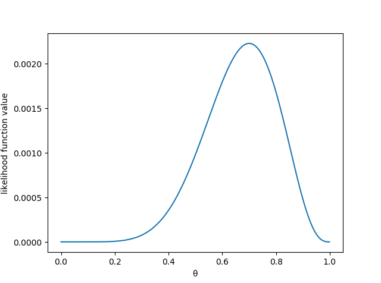
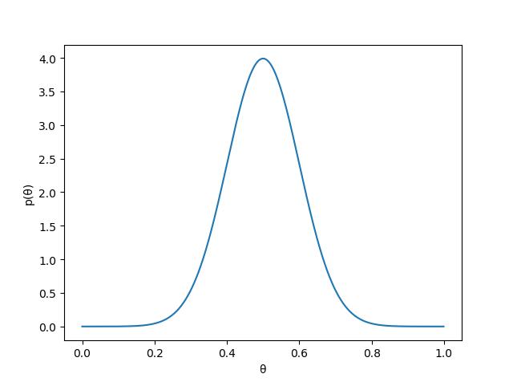
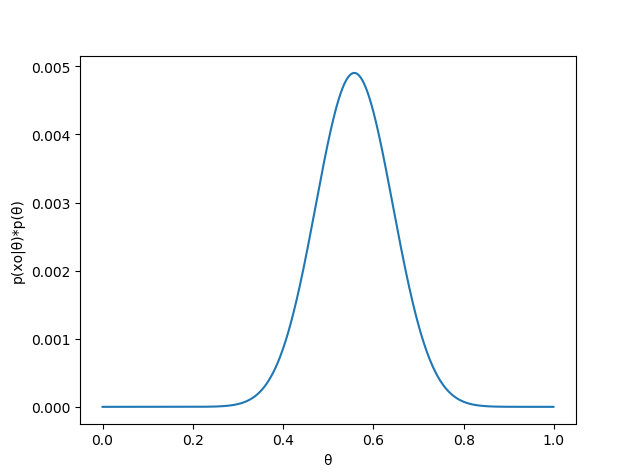
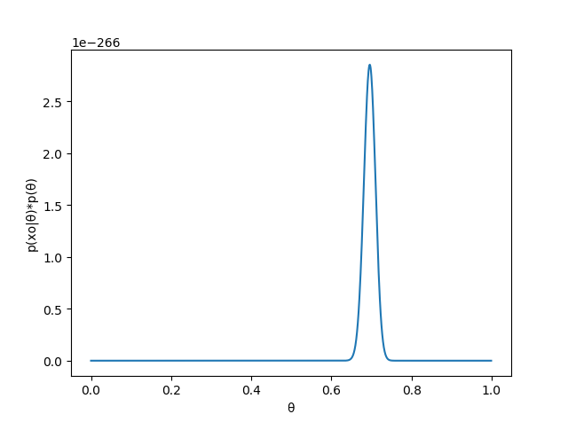

> 来源： https://blog.csdn.net/u011508640/article/details/7281598
# 贝叶斯公式+最大似然估计(MLE)+最大后验概率公式(MAP)
## 1.贝叶斯公式
$$ P(A|B) = \frac{ P(B|A) \times P(A) }{ P(B|A) \times P(A) + P(B|\sim A) \times P(\sim A) } $$
- 作用： 
  - 你有多大把握相信一件证据。 给定 $B$ 的时候，你有多大的可能性会去相信 $A$ 能够成立。
  - 在做判断的时候需要考虑所有的因素。
    - 一件很难发生的事情 $P(A)$ 即使出现某个证据 $B$ 和它强相关 $P(B|A)$ 也要谨慎，因为证据可能来自其他虽然不是强相关但发生概率较高的事情 因为 $P(B|\sim A) \times P(\sim A)$ 可能会比较大从而导致$P(B|A)$ 比较小。 
  - 根据已知的或者主观容易断定的条件概率事件，计算出未知的或者较难评估的条件概率事件
  
## 2. 似然函数
对于函数 $P(x| \theta)$:
- 当 $\theta$ 是已知的情况下， $x$ 是变量， 这个函数叫做概率函数（probability function）, 用来描述对于不同的样本点 $x$ , 其出现的概率是多少。
- 当 $x$ 是已知的情况下， $\theta$ 是变量， 这个函数叫做似然函数（likelihood function）, **用来描述对于不同的模型参数**， 这个样本点出现的概率是多少。 

## 3. 最大似然估计（maximum likelihood estimation : MLE）
- 构造一个关于参数 $\theta$ 的函数， 这个函数用来表示在已知的一组实验中产生了一组实验数据 $x_0$ 的可能性。
  - 在抛硬币实验中，每次抛硬币出现正反的概率满足二项分布。
  - 比如抛了10次，出现的一组实验数据 $x_0=[0111101110]$。 
  - 似然函数为： $f(\theta) = ((1−\theta) × \theta × \theta × \theta × \theta × (1 − \theta)× \theta × \theta × \theta ×(1−\theta))=\theta^7 \times (1 - \theta)^3$
- 计算使似然函数最大的参数值， 一般先取对数然后计算。
  - $\log f(\theta) = 7\log \theta + 3\log (1-\theta) $ 
  - 求导可以得到： $\frac{7-10\theta}{\theta (1-\theta)}$
  - 可以得到当$\theta = 0.7$ 的时候能够得到最大值。
## 4. 最大后验概率估计（maximum a posterior probability estimation: MAP）
最大似然估计的目的是通过求解得到 $\theta$ 使得似然函数 $P(x_0|\theta)$ 达到最大。 而最大后验概率估计是在最大似然估计的情况下考虑先验概率分布$P(\theta)$ 。使得 $P(\theta) \times P(x_0 | \theta)$ 达到最大。 
- 最大后验概率估计的目的其实是为了最大化后验： $P(\theta | x_0) = \frac{ P(x_0|\theta) \times P(\theta) }{P(x_0)} $ 因为 $P(x_0)$ 是可以通过做实验得到的。 所以只需要求解 $P(\theta) \times P(x_0 | \theta)$  使其最大。
- 最大后验的名字来源于  $P(\theta | x_0)$ 就是要在已有实验数据的情况下求解最合理的参数。

## 5. 一个简单的例子
投硬币10次得到的结果是$x_0 = [0111101110]$
- 最大似然函数， 上面已经说过了对应的似然函数是：  $f(\theta) =\theta^7 \times (1 - \theta)^3$
  - 代码：
  ```python
  import math
  import matplotlib.pyplot as plt
  def mle_value():
      """最大似然估计： x表示 θ 值"""
      x = [0.001*i for i in range(0, 1000)]  # 不同的参数 θ 的值
      y = [i**7 * (1-i)**3 for i in x]  # θ对应的似然函数值

      print('对应最大值的θ是:', x[y.index(max(y))])

      plt.plot(x, y)
      plt.xlabel('θ')
      plt.ylabel('likelihood function value')
      plt.show()
  ```
  - 结果
  
- 根据先验知识假定 P(θ) 为均值为0.5， 方差为0.1 的高斯函数，可以画出对应的概率密度图"
  - 代码
  ```python
  def prior_value():
      """根据先验知识假定 P(θ) 为均值为0.5， 方差为0.1 的高斯函数，所以可以画出 θ 和 P(θ) 的图像： 一个高斯分布的密度函数，密度越大可能性越大"""
      def p_theta(u):
          return 1/((2*math.pi*0.01)**(1/2))*math.exp(-(u-0.5)**2/(2*0.01))
      x = [i*0.001 for i in range(0, 1000)]
      y = [p_theta(i) for i in x]

      print('对应最大概率密度的θ值是:', x[y.index(max(y))])

      plt.plot(x, y)
      plt.xlabel('θ')
      plt.ylabel("p(θ)")
      plt.show()
  ```
  - 结果
    
- $P(\theta)$ 的先验知识和似然函数$P(x_0 | \theta)$ 可以画出后验的图
  - 代码 
  ```python
   """假定 p(θ) 满足均值为 0.5 方差为 0.1 的概率密度的情况下， 计算联合概率密度的值 p(xo|θ)*p(θ)， 联合概率反映了后验概率的数值大小 """
    def p_theta(u):
        return (1/((2*math.pi*0.01)**(1/2))*math.exp(-(u-0.5)**2/(2*0.01))) * (u**7 *(1-u)**3)
    x = [i*0.001 for i in range(0, 1000)]
    y = [p_theta(i) for i in x]

    print('对应最大联合概率密度的θ值是:', x[y.index(max(y))])

    plt.plot(x, y)
    plt.xlabel('θ')
    plt.ylabel("p(xo|θ)*p(θ)")
    plt.show()
  ```
  - 结果
  
- $P(\theta)$ 的先验知识和似然函数$P(x_0 | \theta)$ 通过多做几次实验可以得到更加准确的结果
  - 代码
  ```
  def map_value100():
    """ 实验了100次会得到的结果 """
    def p_theta(u):
        return (1/((2*math.pi*0.01)**(1/2))* math.exp(-(u-0.5)**2/(2*0.01))) * (u**7 *(1-u)**3)**70*(u**7 *(1-u)**3)**30

    x = [i*0.001 for i in range(0, 1000)]
    y = [p_theta(i) for i in x]

    print('对应最大联合概率密度的θ值是:', x[y.index(max(y))])

    plt.plot(x, y)
    plt.xlabel('θ')
    plt.ylabel("p(xo|θ)*p(θ)")
    plt.show()
  ```
  - 结果
  

  


