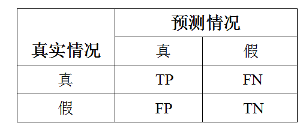

# 1 统计学习
## 1.1 统计学习的特点
- 平台是计算机和网络
- 研究对象是数据
- 目的是对数据进行预测和分析
- 以方法为中心 （构建模型）
- 是概率论，统计学，信息论， 计算理论等多个领域的交叉学科

## 1.2 统计学习方法的三个要素
- 模型的假设空间（模型）
- 模型选择的准则（策略）
- 模型学习的算法（算法）

## 1.3 分类
- **监督学习**
- 非监督学习
- 半监督学习
- 强化学习

# 2 监督学习
## 2.1 基本概念
### 符号集合
| 符号 | 含义|
| :-: | :-: |
|$X$|输入变量， 文中的所有变量都是列向量|
|$Y$|输出变量， 文中的所有变量都是列向量|
|$x$|输入变量的取值 $x=(x^{(1)}, x^{(2)},...,x^{(i)},...,x^{(n)})^T$| 
|$x_i$| 第$i$个变量的取值 $x_i = (x_i^{(1)}, x_i^{(2)},...,x_i^{(i)},...,x_i^{(n)})^T$|
|$T$| 训练数据的集合 $T=\{(x_1,y_1), (x_2,y_2), ..., (x_N, y_N)\}$|
|$\mathcal{X}$|由输入变量 $X$ 组成的输入空间|
|$\mathcal{Y}$|由输出变量 $Y$ 组成的输入空间|
|$\mathcal{F}$|假设空间（模型空间，自己取得名字）|
|$L(Y, f(X))$| 由模型的预测$f(x)$ 和 实际标签$Y$ 组成的损失函数|

### 输入空间和输出空间
将输入和输出所有可能取值的集合称为输入空间。
### 特征向量（feature vector）
每个具体的输入是一个实例（instance），通常由特征向量表示。
### 特征空间（feature space）
所有的特征向量存在的空间称为特征空间。
### 回归问题和分类问题
- 回归问题： 输入变量和输出变量均为连续变量的预测问题。
- 分类问题： 输出变量为有限个离散变量的预测问题为分类问题。
### 联合概率分布和假设空间
- 监督学习的基本假设： 假设数据之间存在一定的统计规律， $X$ 和 $Y$之间存在着联合概率分布。 并且认为训练数据和测试数据是依联合概率分布 $P(X,Y)$ 独立同分布产生的。 
- 假设空间（hypothsis space）： 输入输出之间映射的集合（所有可能的模型）。 由条件概率 $P(Y|X)$ 或者决策函数（decision function) $Y=f(x)$ 表示。

# 3 统计学习中的三要素
统计学习方法由三部分组成可以简单的表示：

方法 = 模型+策略+算法
 

## 3.1 模型
在监督学习过程中模型就是所学的条件概率分布或者决策函数。  模型的假设空间$\mathcal{F}$由所有可能的条件概率分布或者决策函数组成。 因此假设空间$\mathcal{F}$可以通过下面这些式子表示。

- 决策函数的集合
  - 普通的写法
  $$ \mathcal{F} = \{ f| Y = f(X) \} $$
  - 由于假设空间通常是由一个参数向量决定的函数族，所以也可以写成
  $$ \mathcal{F} = \{ f| Y = f_\theta (X) \} $$
- 条件概率的集合
  - 一般的写法
  $$ \mathcal{F} = \{ P| P(Y|X) \} $$
  - 加上参数的写法
  $$ \mathcal{F} = \{ P| P_\theta (Y|X) \} $$
  
## 3.2 策略
tags: 损失函数， 风险函数， 期望风险， 期望损失， 经验风险， 经验损失，  结构风险
### 3.2.1  [极大似然估计 + 最大后验概率估计](https://github.com/hekang123456/markdown_file/blob/master/statistic_learning_method/BT_MLE_MAP.md)
-  极大似然估计（maximum likelihood estimation 简称MLE）
  通过实验得到实验结果 $x_0$， 通过先验知识确定这个实验结果出现的概率函数称为似然函数 $P(x_0|\theta)$, 最后通过取对数值然后求导等方法求得使似然函数取最大值事的参数 $\theta$。
- 最大后验概率估计(maximum a posterior probability estimation 简称MAP)
  通过实验数据找到最合适的参数 $P(\theta|x_0)$, 由于 $P(\theta|x_0) = \frac{P(x_0|\theta) \times P(\theta)}{P(x_0)}$， 因为 $P(x_0)$ 可以通过实验得到，因此最大化后验只需要求最大化 $P(x_0|\theta) \times P(\theta)$ 前半部分是似然函数， 后半部分是先验。

### 3.2.2 相关概念
- 损失函数（loss function）： 又称代价函数(cost function) 用来度量预测错误的程度。 损失函数是 $f(X)$ 与 $Y$ 的**非负实值函数**。 记为 $L(Y, f(X))$。 
  - 常见的损失函数
    - 0-1 损失函数 (0-1 loss function)
      $$ L(Y,f(X)) = \begin{array}{lc} 1&, Y\neq f(X) \\ 2&,Y=f(X)  \end{array} $$
    - 平方损失函数（quadratic loss function）
      $$ L(Y,f(X)) = (Y-f(X))^2 $$
    - 绝对值损失函数（absolute loss function）
      $$L(Y,f(X)) = |Y-f(X)| $$
    - 对数损失函数（logarithmic loss function） 或者 对数似然损失函数 (likelihood loss function)
      $$ L(Y,P(Y|X)) = -\log (P(Y|X))  $$
- 风险函数（risk function） 又称 期望损失（expected loss）
  $$ R_{exp} (f) = E_p [L(Y, f(X))] = \int_{\mathcal{X} \times \mathcal{Y}} L(x, f(x)) P(x, y) dxdy$$
- 经验风险 （empirical risk） 又称 经验损失 （empirical loss）
  $$ R_{emp} (f) = \frac{1}{N} \sum\limits_i^N L(y_i, f(x_i)) $$ 
- 经验风险最小化与结构风险最小化
  - 经验风险最小化
    $$\min\limits_{f \in \mathcal{F}} \frac{1}{N} \sum\limits_{i=1}^N L(y_i, f(x_i))$$
    当模型是条件概率分布，损失函数是对数损失函数，经验风险最小化就等价于最大似然估计。
  - 结构风险最小化
    结构风险最小化(structural risk minimization, SRM)： $R_{srm} (f) = \frac{1}{N} \sum\limits_{i=1}^N L(y_i, f(x_i)) +\lambda J(f) $ $J(f)$ 是定义在假设空间 $\mathcal{F}$ 上的泛函，模型越复杂越大。$\min R_{srm}(f)$  
    当模型是条件概率分布，损失函数是对数损失函数, 模型的复杂度由模型的先验概率表示时，结构风险最小化就等价于最大后验概率估计。

## 3.3 算法
- 算法： 学习模型的具体计算方法。
- 统计机器学习基于训练数据集，根据学习策略（模型） ，从假设空间中通过相应的算法求解最优模型。
- 统计学习问题可以归结为最优化问题。

# 4. 模型的评估和模型的选择
注：1.统计学习方法具体采用的损失函数未必是评估时使用的损失函数。 
2. 通常将学习方法对未知数据的预测能力称为泛化能力（generalization ability）
- 过拟合： 参数过多， 已知数据预测很好， 未知数据预测很差
- 奥卡姆剃刀（Occam's razor） 原理：能解释已知数据，并且十分简单才是最好的模型。
## 4.1 模型选择的方法
- 正则化：$\min\limits_{f\in\mathcal{F}} \frac{1}{N} \sum\limits_{i=1}^N L(y_i, f(x_i)) +\lambda J(f) $ 也就是结构风险最小化。 常用的正则化项包括对参数向量的一范式和二范式。
- 交叉验证：数据不充分的时候切分数据集反复进行训练，测试和模型选择。
  - 简单交叉验证
  - S折交叉验证
  - 留一交叉验证

## 4.2 泛化误差, 泛化误差上界（29页）
- 证明(......)
训练误差小的模型， 其泛化误差也会小

# 5 生成模型和判别模型
## 5.1 生成模型
- 由数据学习联合概率分布 $P(X, Y)$, 求出条件概率分布 $P(Y|X)$ 作为预测的模型，即生成模型。 $P(Y|X) = \frac{P(X, Y)}{P(X)} $ 
- 常用的方法： 朴素贝叶斯方法和隐马尔科夫模型
- 特点： 1. 能够还原出联合概率分布$P(X, Y)$； 2.学习收敛速度快； 3. 当存在隐变量的时候任然能够用生成模型学习。

## 5.2 判别模型
- 由数据直接学习决策函数 $f(x)$ 或者条件概率分布 $P(Y|X)$ 作为预测的模型。 判别模型关系的是给定的 $X$ 应该预测什么样的输出 $Y$。 
- 常用的方法：k 近邻法， 感知器， 决策树， 逻辑斯迪克回归， 最大熵模型， 支持向量机， 提升方法和条件随机场等。
- 特点： 1. 直接学习条件概率$P(Y|X)$或者决策函数$f(X)$ ,直接面对预测，往往学习率更高； 2. 可以对数据进行各种程度上的抽象，定义特征并使用特征，因此可以简化学习问题。

# 6 分类问题
- 评价指标

- 精确率： $P = \frac{TP}{TP+FP}$
- 召回率： $R = \frac{TP}{TP+FN}$
-  $F_1$值：$\frac{2}{F_1} = \frac{1}{P} + \frac{1}{R}$ => $F_1 = \frac{2TP}{2TP+FP+FN}$  

- 主要的分类方法： k近邻法、 感知机、 朴素贝叶斯法、 决策树、决策列表、 逻辑斯谛回归模型、 支持向量机、 提升方法、 贝叶斯网络、 神经网络、Winnow 等。

# 7 标注问题
- 训练数据： $T = \{ (x_1, y_1), (x_2, y_2), ..., (x_N, y_N) \}$。  其中 $x_i = (x_i^{(1)}, x_i^{(2)},..., x_i^{(n)})^T$ 对应的标记序列是：$y_i = (y_i^{(1)}, y_i^{(2)}, ..., y_i^{(n)})^T$。
- 学习系统： 表示为条件概率为： $P(Y^{(1)}, Y^{(2)}, ..., Y^{(n)}| X^{(1)}, X^{(2)}, ..., X^{(n)})$
- 评价指标： 和分类问题一样，标注准确率， 精确率和召回率。
- 学习方法： 隐马尔可夫模型， 条件随机场

# 8 回归问题
回归模型表示从输入变量到输出变量之间映射的函数， 回归问题的学习等价于函数拟合。
- 模型： $Y = f(X)$
- 损失函数： 平方损失函数（在此情况下可以采用最小二乘法求解）。

