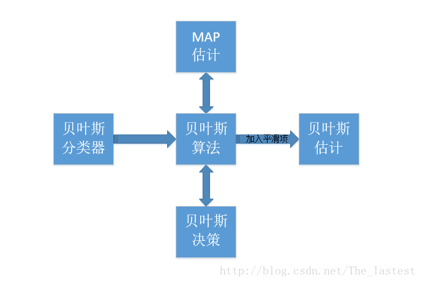

# 朴素贝叶斯法
## 1 [极大似然估计， 最大后验， 贝叶斯估计](https://github.com/hekang123456/markdown_file/blob/master/statistic_learning_method/BT_MLE_MAP.md)。

- 极大似然估计
  - 根据实验数据构造似然函数: $f(\theta)$.
  - 求取得最大值的参数$\theta$. $\arg\limits_{\theta} \max f(\theta)$
- 最大后验估计
  - 求最大后验 $P(\theta |x_0) = \frac{P(x_0 | \theta)\times P(\theta)}{P(x_0)}$. 其中 $P(\theta)$是先验分布， $P(x_0 | \theta)$是似然函数。 
  - 因为$P(x_0)$ 由实验结果决定，所以上述等价于最大化 $P(x_0| \theta) \times P(\theta)$ 
  - 所以这个和极大似然估计相比，多了一项先验分布。 也是用来求 $\arg\limits_{\theta} \max P(x_0| \theta) \times P(\theta)$
- 贝叶斯估计
  - 求后验分布 $P(\theta | X) = \frac{P(X| \theta) \times P(\theta)}{P(X)}$,  通过实验可以确定 $P(X)$, $P(X|\theta)$ 是似然函数， $P(\theta)$ 是先验分布。  
  - 在极大似然估计和 最大后验估计中都是通过做得的最为频繁发生的数据结果来推出当$\theta$满足某个值的时候能够最大可能性的得到这个结果。
  - 贝叶斯估计是认为 $\theta$也是一个分布， 为了求解这个分布往往需要我们将先验分布和后验分布假设为共轭先验。

## 2 朴素贝叶斯法的学习和分类

### 2.1 朴素贝叶斯法基本概念

**符号说明：** $x_i^{(j)}$ 是第$i$个样本的第$j$个特征； $a_{jl}$ 是第$j$个特征可能取的第$l$个值； $I$是指示函数， 满足条件为1，否则为0.

我们首先看一张关于不同的名称之间关系的图[(来源)](https://blog.csdn.net/The_lastest/article/details/78807198)：

根据这张图我们可以知道贝叶斯法和最大后验估计（maximum a posteriori estimation）是一样的。 只是采用了最大后验的方法来进行分类。 

- **贝叶斯公式：**我们首先列出在给定一个实例 $X$  的情况下对标签 $Y$ 进行预测的公式（贝叶斯公式）：
  $$ P(Y= c_k| X=x) = \frac{P(X=x | Y=c_k)P(Y=c_k)}{\sum\limits_k P(X=x|Y=c_k)P(Y=c_k)}$$
- **预测未知数据就要求解的参数：**我们需要通过已有的实验数据对未知的数据进行预测， 那么我们需要通过已有的数据得到先验概率分布 $P(Y=c_k), k=1,2,...,K$ 和条件概率分布 $P(X=x|Y=c_k) = P(X^{(1)}=x^{(1)}, ..., X^{(n)}=x^{(n)}|Y=c_k), k=1,2,...,K$ 。
- **最大似然求解先验概率分布**：先验概率分布 $P(Y=c_k), k=1,2...,K$是容易通过已有数据得到的, 利用极大似然估计就能够得到： $P(Y=c_k) = \frac{\sum\limits_{i=1}^N I (y_i = c_k)}{N}, l=1,2,..,K $. 将 $P(Y=c_k)$ 看做是参数， 似然函数是 $P(Y=c_k) * N$. 
- **参数过多：**条件概率分布 $P(X=x|Y=c_k) = P(X^{(1)}=x^{(1)}, ..., X^{(n)}=x^{(n)}|Y=c_k), k=1,2,...,K$ 是非常难求的。 因为对应于每个$x^{j}$ 的可能取值有 $S_j$ 个， 那么参数的个数有 $K\prod\limits_{j=1}^nS_j$ 个。这里的参数指的就是 每一个条件概率 $P(X=x|Y=c_k)$。 比如$n=10, S_j =10, K=10$ ,那么参数量是$10^{11}$ ,显然就太多了。
- **条件独立性假设：**为了解决条件概率参数太多的问题，贝叶斯法对条件概率做了条件独立的假设：
  $$ P(X=x|Y=c_k) = P(X^{(1)}=x^{(1)}, ..., X^{(n)}=x^{(n)}|Y=c_k)= \prod\limits_{j=1}^nP(X^{(j)}=x^{(j)}|Y=c_k)$$ 
- **引入了条件独立性假设的后验概率计算：**
  $$\begin{align} P(Y= c_k| X=x)  &= \frac{P(X=x | Y=c_k)P(Y=c_k)}{\sum\limits_k P(X=x|Y=c_k)P(Y=c_k)} \\  &= \frac{P(Y=c_k) \prod\limits_{j=1}^nP(X^{(j)}=x^{(j)}|Y=c_k) }{\sum\limits_k P(Y=c_k)\prod\limits_{j=1}^nP(X^{(j)}=x^{(j)}|Y=c_k)  }\end{align} $$
- **贝叶斯分类器：**
  $$y=f(x) = \arg\max\limits_{c_k}  \frac{P(Y=c_k) \prod\limits_{j=1}^nP(X^{(j)}=x^{(j)}|Y=c_k) }{\sum\limits_k P(Y=c_k)\prod\limits_{j=1}^nP(X^{(j)}=x^{(j)}|Y=c_k)  }$$
- **简化：** 因为对于不同的 $c_k$ 在已经学习好的模型（先验概率通过最大似然求出来了，条件概率通过条件独立性假设求出来了）上是一个常数，所以可以忽略掉分母：
$$y=f(x) = \arg\max\limits_{c_k} P(Y=c_k) \prod\limits_{j=1}^nP(X^{(j)}=x^{(j)}|Y=c_k) $$

### 2.2 后验概率最大化的含义
朴素贝叶斯法将实例分到后验概率最大的类中， 这等价于期望风险最小化
**证明：** 损失函数为0-1损失函数。
$$
\begin{align} L(Y,f(X)) = \begin{cases} 1, Y\neq f(X) \\ 0, Y=f(X)  \end{cases} \end{align}
$$

期望风险函数等于 $R_{exp}(f) = E[L(Y,f(X))]$ 在这里取联合期望为： $R_{exp} (f) =E_{X} \sum\limits_{k=1}^K [L(c_k, f(X))]P(c_k | X)$ 为了使得期望风险最小， 只需要对$X=x$ 逐个极小化，由此得到：
$$
\begin{align} 
f(x) &= \arg \min\limits_{y \in \mathcal{Y}} \sum\limits_{k=1}^K L(c_k , y) P(c_k|X=x) \\
&= \arg \min_\limits{y \in \mathcal{Y}} \sum\limits_{k=1}^K P(y \neq c_k |X=x) \\
&= \arg \min_\limits{y \in \mathcal{Y}} (1-P(y=c_k|X=c_k)) \\
&= \arg \max_\limits{y \in \mathcal{Y}} P(y=c_k |X=x)
\end{align}
$$
所以，根据期望风险最小化准则就得到了后验概率最大化准则。
$$
f(x)= \arg \max_\limits{y \in \mathcal{Y}} P(y=c_k |X=x)
$$

### 2.3 极大似然估计求解参数值
- 先验概率 
$$
P(Y=c_k) = \frac{\sum\limits_{i=1}^N I(y_i = c_k)}{N}, k=1,2,...,K
$$
- 条件概率 

$$
\begin{align}
P(X^{(j)}=a_{jl} | Y=c_k) = \frac{\sum\limits_{i=1}^{N}I(x_i^{(j)},y_i = c_k)}{\sum\limits_{i=1}^NI(y_i = c_k)} \\
j=1,2,...,n; l=1,2,...,S_j; k=1,2,...,K
\end{align}
$$

## 3 朴素贝叶斯算法（naive Bayes algorithm）
- 利用极大似然估计计算先验概率 $P(Y=c_k)$ 和条件概率 $P(X^{(j)}=a_{jl}|Y=c_k)$ 。
- 计算
$$
P(Y=c_k) \prod\limits_{j=1}^nP(X^{(j)}=x^{(j)}|Y=c_k)
$$
- 确定类别
$$
y = \arg\max\limits_{c_k} P(Y=c_k) \prod\limits_{j=1}^nP(X^{(j)}=x^{(j)}|Y=c_k)
$$

## 4 利用贝叶斯估计取代最大似然估计
**用极大似然估计可能会出现所要估计的概率值为0的情况**。 这时会影响到后验概率的计算结果， 使分类产生偏差。解决这一问题的方法是采用贝叶斯估计。 具体地， **条件概率的贝叶斯估计**是：
$$
P_\lambda(X^{(j)}=a_{jl} | Y=c_k) = \frac{\sum\limits_{i=1}^{N}I(x_i^{(j)},y_i = c_k) + \lambda}{\sum\limits_{i=1}^NI(y_i = c_k) + S_j\lambda}
$$
$\lambda>0$ , 当 $\lambda=0$的时候就是极大似然估计。 常取 $\lambda=1$ 称为拉普拉斯平滑。 显然对于任意依噶条件概率都大于0 并且求和为1.
**先验概率的贝叶斯估计**是：
$$
P_\lambda (Y=c_k) =\frac{\sum\limits_{i=1}^N I (y_i = c_k)+\lambda}{N+K\lambda}
$$

## 5 贝叶斯估计， 最大后验， 最大似然， 朴素贝叶斯法
所有的这些方法都是建立在贝叶斯公式的基础上的。 最大后验，最大似然和贝叶斯估计都是对参数进行估计。 
- 最大似然:它假设随机变量 $X$ 满足某个分布，其中具有参数$\theta$ , 根据 $\theta$我们可以写出得到某一组实验数据的概率表达式（似然函数）， 通过实验我们得到了一组实验数据$x_0$, 我们通过对似然函数进行取对数然后求导的方法得到一个确定的$\theta$值，使得得到这组实验数据的概率最大。

- 最大后验：最大后验估计在最大似然的基础上引入了先验概率。 通过贝叶斯估计， 也能够得到不同的$\theta$ 值得到$X$ 的概率。 我们希望计算 $\theta$使得实验得到的$x_0$ 在该后验概率中发生的可能性是最高的。

- 贝叶斯估计： 最大似然和最大后验，只是希望得到使得实验数据可能性最高的一个参数值，而贝叶斯估计中希望确定参数$\theta$ 的分布， 为了能够确定这个分布， 我们需要使得贝叶斯公式得到的结果满足概率的几个要素（积分为1， 单调）。 因此常用共轭先验的方法来简化模型。

- 朴素贝叶斯法：朴素贝叶斯法是建立在贝叶斯定理和条件独立性假设下的分类算法。 在利用朴素贝叶斯法建立分类模型时，相关的先验分布， 条件分布的参数一般是通过最大似然的方法和贝叶斯估计的方法求得的。

 贝叶斯法是一种生成模型

